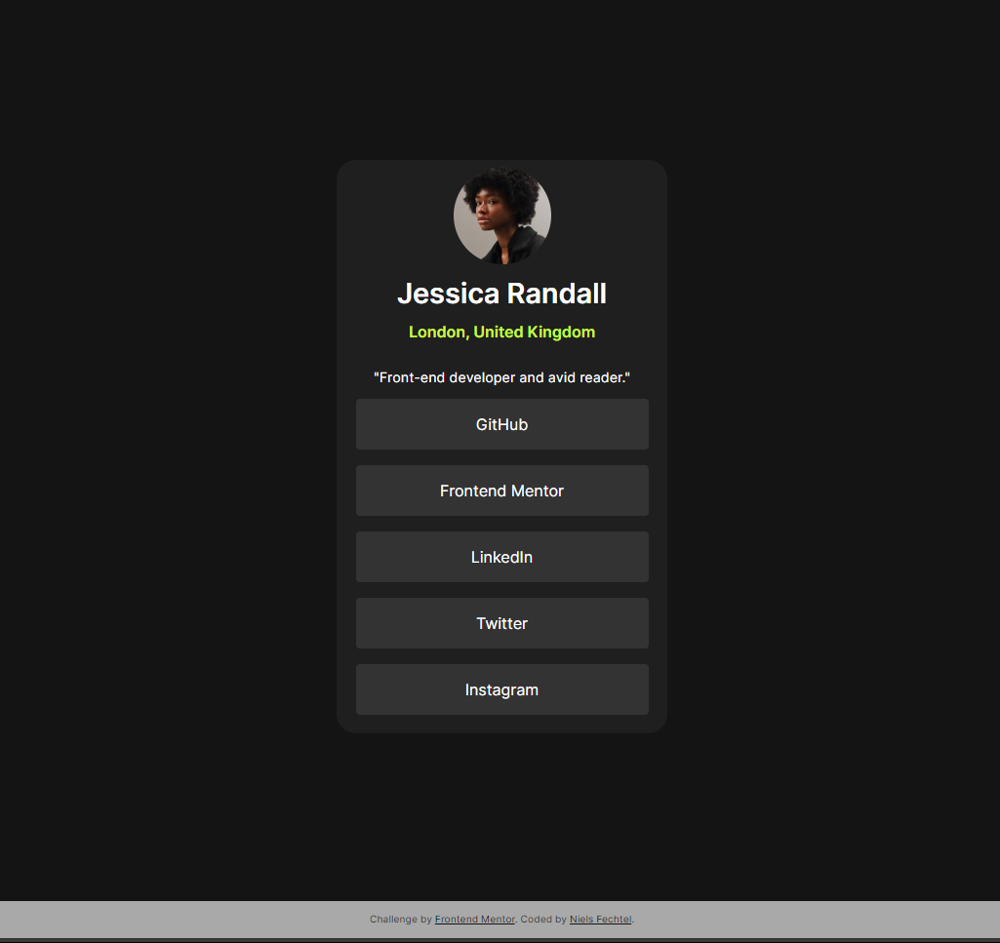

# Frontend Mentor - QR code component solution

Hi, Niels here.
This is a solution to the [Social links profile challenge on Frontend Mentor](https://www.frontendmentor.io/challenges/social-links-profile-UG32l9m6dQ).
[Hosted on GH pages](https://github.com/nielsfechtel/frontendmentor_1_social_links_profile).

## Table of contents

- [Frontend Mentor - QR code component solution](#frontend-mentor---qr-code-component-solution)
  - [Table of contents](#table-of-contents)
  - [Overview](#overview)
    - [Screenshot](#screenshot)
    - [What I learned](#what-i-learned)
  - [Author](#author)

## Overview

### Screenshot



### What I learned

Using max() for responsive height- and width-values.

```css
  height: max(40vh, 550px);
  width: max(12vw, 250px);
```

## Author

- Website - [Niels Fechtel](https://niels-fechtel.com)
